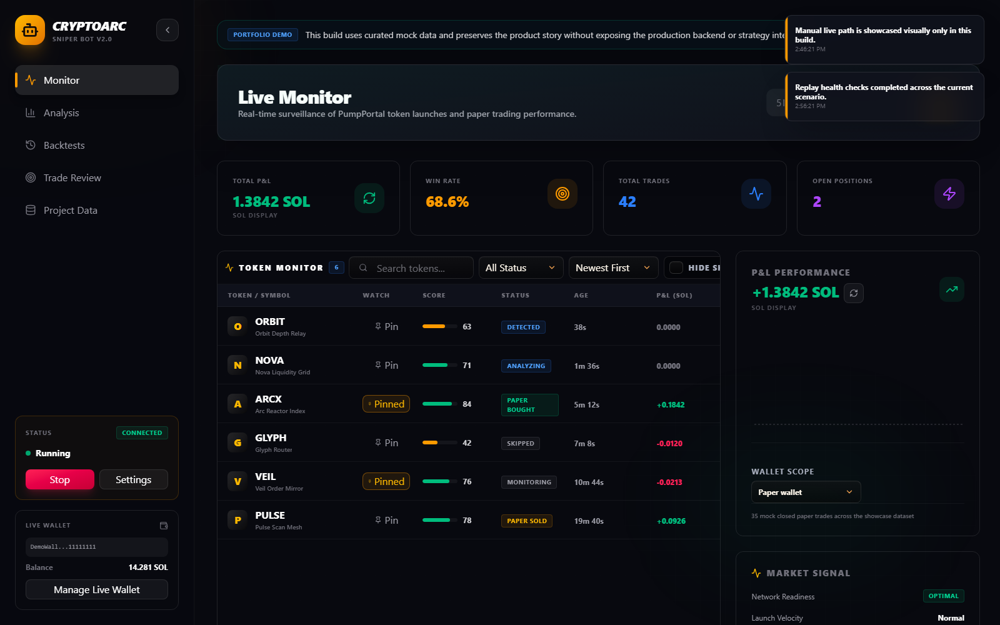
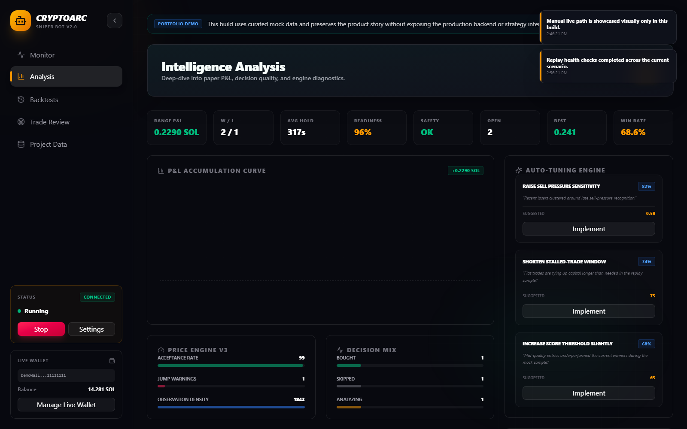
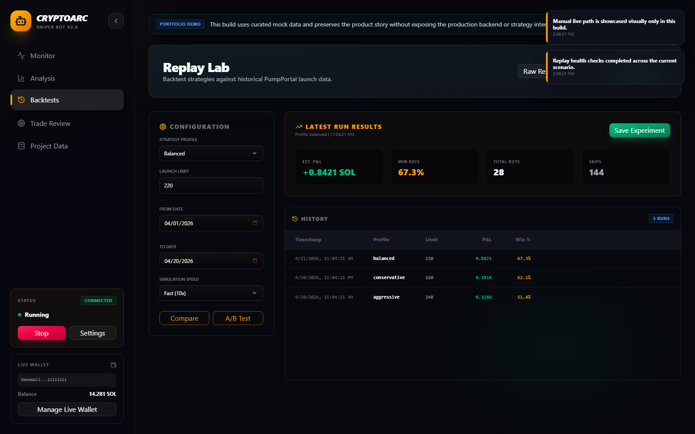
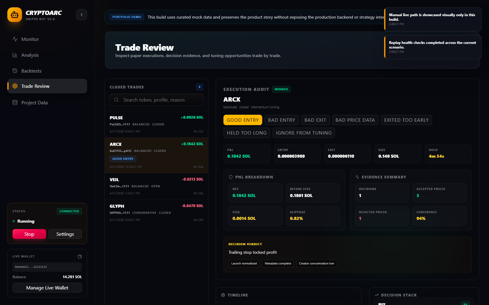
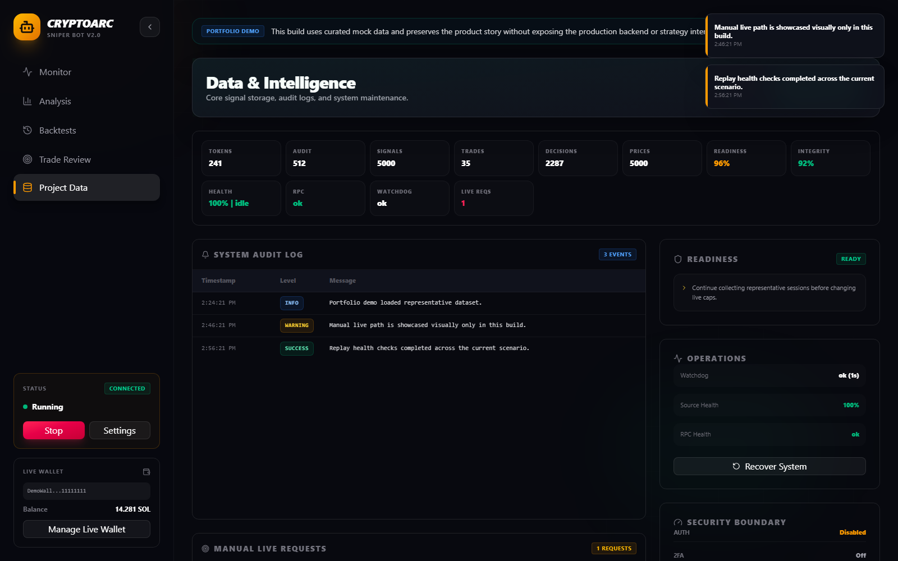

# CryptoARC v2 Portfolio Demo

CryptoARC v2 Portfolio Demo is a portfolio-safe showcase build of a market-intelligence terminal for researching Pump.fun launch activity, paper-trading behavior, and operator workflows.

It is intentionally separated from the private working repository and uses curated mock data only. The goal is to let reviewers explore the product experience, interface quality, and product thinking without exposing the production backend, strategy implementation, operational code, or live-trading internals.

## Why This Exists

This repo is meant for:

- recruiters who want to understand the product quickly
- engineers who want to see system design translated into UI
- collaborators who want to click through the operator experience

It is not a stripped copy of the real codebase. It is a separate public-facing demo designed for safe sharing.

## Live Demo

- [Open the hosted demo](https://arirosner.github.io/CryptoARC-v2-portfolio-demo/)

## Gallery

### Live Monitor



### Analysis Workspace



### Replay Lab



### Trade Review



### Data & Intelligence



## Guided Walkthrough

If you only spend three minutes in the demo, this is the path I recommend:

1. Open **Live Monitor**
   - skim the token queue
   - click a token to open the detail view
   - switch the P&L scope between paper and the mock live wallet
2. Open **Analysis**
   - look at readiness, strategy performance, and auto-tuning suggestions
3. Open **Replay Lab**
   - review the latest run and historical backtests
4. Open **Trade Review**
   - inspect one trade end to end through timeline, decisions, and labels
5. Open **Data & Intelligence**
   - scan the audit log, health surfaces, and safety boundary summary

## What This Demo Shows

- Live Monitor experience with token queue, watchlist, P&L card, and token detail view
- Analysis workspace with readiness, diagnostics, strategy performance, and tuning suggestions
- Replay Lab / Backtests workspace with representative historical runs
- Trade Review workspace with timeline, decision context, and labeling flow
- Data & Intelligence workspace with audit-style surfaces, health, readiness, and operations summaries
- Live Wallet showcase modal illustrating the manual browser-wallet direction at a product level

## What This Demo Does Not Include

- No real backend
- No private keys or wallet signing
- No live execution
- No private strategy logic
- No real data feeds
- No production auth or deployment internals

## Tech

- React
- TypeScript
- Vite
- Tailwind CSS
- Framer Motion
- Recharts

## Easiest Way To Open It Locally

For most Windows users:

1. Make sure [Node.js LTS](https://nodejs.org/) is installed once on the computer.
2. Double-click [Open CryptoARC Demo.cmd](./Open%20CryptoARC%20Demo.cmd).
3. Wait a few seconds while the demo starts.
4. Your browser should open automatically.

The first launch may take a little longer because it installs the demo dependencies.

## Developer Run

```powershell
npm install
npm run dev -- --host 127.0.0.1 --port 4173
```

## Build

```powershell
npm run build
```

## Notes

This demo is meant for portfolio review, interviews, and product walkthroughs. It is not intended to represent the full internal architecture or production safety implementation of the private CryptoARC v2 codebase.
